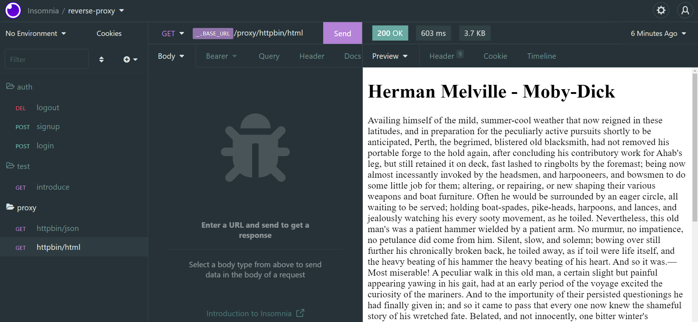

# reverse-proxy

By [Hesamsrk](https://www.linkedin.com/in/hesamsrk/)

## What is it?

A fully functional, configurable yet simple `reverse-proxy` which you can use it to manage and secure your existing
applications.

This application uses [Express](https://www.npmjs.com/package/express)
, [typescript](https://www.npmjs.com/package/typescript)
, [JWT](https://jwt.io/)
, [MYSQL](https://www.mysql.com/), [Sequelize-typescript](https://www.npmjs.com/package/Sequelize-typescript)
and [http-proxy](https://www.npmjs.com/package/http-proxy)

### Add new services

You can change the `services.config.ts` file to add new services or configure existing ones.

- Using this config file you can register as many as applications you want the reverse proxy connect to:

```typescript
import {ServiceConfigs} from "./src/types/service";

export const services: ServiceConfigs[] = [
    {
        name: "httpbin",
        hostname: "httpbin.org",
        protocol: "http",
    },
    {
        name: "myApplication",
        hostname: "localhost:3000",
        protocol: "http",
    },
];
```

* As default, the only connected service is [httpbin](https://httpbin.org)

## How to run this application?

### Recommended approach

- This application is dockerized for ease of use, so you need to install [docker](https://docs.docker.com/get-docker/)
  and [docker-compose](https://docs.docker.com/compose/install/) to run this program.
- After running docker and docker-compose simply run:

```
docker run -d --rm --name mydatabase -e MYSQL_ROOT_PASSWORD=13731378 -e MYSQL_DATABASE=reverseProxy -p 4040:3306  mysql

docker build -t reverse-proxy .

docker run -d --rm --name reverse-proxy-app -p 6969:6969 reverse-proxy
```

### Second approach

I had an issue when running the app using docker-compose, but you can also try running everything with that:

```
# for linux and mac
sudo docker-compose up

# OR

# for windows
docker-compose up
```

### Third approach: Running locally (manual)

If you don't want to use docker to run this application for any reason you can still run it on your local machine:

- Install nodejs.
- Install mysql.
- Configure environment-variables:
  `.env`
  ```
  PORT=6969
  JWT_SECRET=avadakdora
  JWT_REFRESH_SECRET=vingardiumleviousa
  DATABASE_HOST=mydatabase
  DATABASE_PORT=3306
  DATABASE_USERNAME=root
  DATABASE_PASSWORD=13731378
  DATABASE_NAME=reverseProxy
  ORIGINS=localhost:3000
  APP_NAME=reverseProxyApp
  ```
- Run these commands in the project root:

```
npm install
npm run syncdb
npm start
```

# How it works?

- First import the `api-document.yaml` file to [insomnia](https://insomnia.rest/) or [postman](https://www.postman.com/)
  .
- There you can see the API end-points:
    - Signup:
      
    - Login:
      
    - Send request, and the reverse-proxy connects you to the target servers:
        - JSON:
          
        - HTML:
          
``
